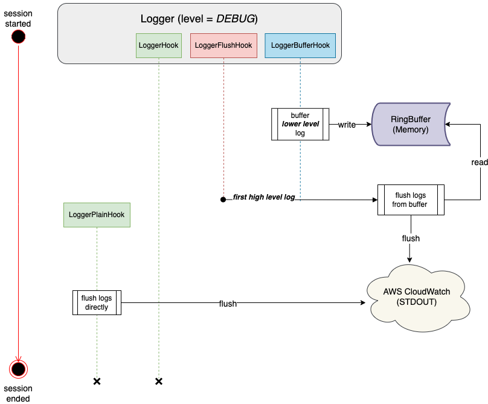

# S1 Logger Module

## Overview

The logger module is an infrastructure microservice used by multiple microservices across the S1 project.

The main two components of the S1 Logger Module is the Logger and the RingBuffer. The standard output of hte Logger can be intergrated to any third party logging systems, AWS CloudWatch for example. Based on `Logrus` and an optimized proposal to save CloudWatch log costs, the workflow of the Logger Module is described in the diagram below:



## Logger

```go
// Logger struct
type Logger struct {
	logrus.Logger

	Options LogOptions

	Resources *Resources
	Category  string
	Buffer    *RingBuffer
	Mode      string
}
```

| field         |            description             |          Value           |
| :------------ | :--------------------------------: | :----------------------: |
| logrus.Logger |    `Logger` is based on logrus     |            -             |
| Options       |   Logger initialization options    |            -             |
| Resources     |                 -                  |            -             |
| Category      |                 -                  |            -             |
| Buffer        | a singleton instance of ringbuffer |            -             |
| Mode          |      switch to control hooks       | BUFFER_MODE / PLAIN_MODE |

### Constants

| Key                   | Type       | Value       |
| :-------------------- | :--------- | :---------- |
| OPT_ALL_DISABLED      | LogOptions | 0x0000      |
| OPT_HAS_REPORT_CALLER | LogOptions | 0x0001      |
| OPT_HAS_SHORT_CALLER  | LogOptions | 0x0002      |
| OPT_DEFAULT           | LogOptions | 0x0003      |
| FILE                  | string     | file        |
| RESOURCE              | string     | res         |
| CATEGORY              | string     | cat         |
| FUNCTION              | string     | func        |
| BUFFER_MODE           | string     | BUFFER_MODE |
| PLAIN_MODE            | string     | PLAIN_MODE  |

### API

- func `New() *Logger`

  Generate a singleton logger and set default options. default options are (`OPT_HAS_REPORT_CALLER|OPT_HAS_SHORT_CALLER`)

---

- func `NewWithOptions(options LogOptions) *Logger`

  Generate a singleton logger and set custom options.

---

- func `NewAlways(options LogOptions) *Logger`

  Always create and return a whole new logger instance and set custom options.

---

- func `SetResource(resource string) *Logger`

  Set the resource which generates logs until cleared. The resource name should lead with a character, in UPPER case, to represent type of resource which is followed by the UUID of resource and seperated by colon ':'.
  e.g. D:112233445566-2020R12345678

  **Resource Types:**

  | Type | Descripption |
  | :--: | :----------- |
  |  D   | Device.      |
  |  U   | User.        |

---

- func `ClearResource() *Logger`

  Clear resource field.

---

- func `SetCategory(category string) *Logger`

  Set the category logs until cleared.

---

- func `ClearCategory() *Logger`

  Clear category field.

---

- func `ClearAll() *Logger`

  Clear resource and category fields, and resets ringbuffer.

---

### Hooks

- LoggerHook

  - Set resource and category that the logger carries
  - Fire level: `all`

---

- LoggerHookBuffer

  - Buffers lower level logs into memory
    - The format of contents to be buffered starts with a `4` byte integer, which is the length of the log itself, then comes with the log content iteslf in bytes
  - Fire level: `warn`, `info`, `debug`, `trace`

---

- LoggerHookFlush

  - Flushes buffered logs to AWS CloudWatch and then sets the remaining logs to `debug` immediately and permanently
    - The functionality to set the remaining logs to `debug` immediately and permanently is achieved by a switch `Mode` in the Logger struct. Once `Mode` is set to plain mode, `LoggerHookBuffer` and `LoggerHookFlush` are disabled and `LoggerHookPlain` is activated
  - Fire level: `panic`, `fatal`, `error`

---

- LoggerHookPlain
  - Simply consoles logs to AWS CloudWatch
    - This hook is disabled by default. Will only be activated once `LoggerHookFlush` gets fired. Once activated, this hook will be hooked permanently within a single session
  - Fire level: `all`

## RingBuffer

```go
// RingBuffer
type RingBuffer struct {
	buf []byte

	initSize int
	size     int
	maxSize  int
	extCoef  int
	vr int
	r  int
	w  int

	isEmpty bool
}
```

| field    |                description                |
| :------- | :---------------------------------------: |
| buf      |              buffer storage               |
| initSize |          initial size of buffer           |
| size     |          dynamic size of buffer           |
| maxSize  |          maximum size of buffer           |
| extCoef  | coefficient for extending buffer strategy |
| vr       |           virtual read pointer            |
| r        |           logical read pointer            |
| w        |           logical write pointer           |

### API

- func `(rb *RingBuffer) Init(defaultSize int, maxSize int, extCoef int) *RingBuffer`

  Returns a ringbuffer initialized with a given default size, maximum size and extension coefficient.

---

- func `(rb *RingBuffer) VirtualRefresh()`

  Refreshes the virtual read pointer.

---

- func `(rb *RingBuffer) VirtualRevert()`

  Reverts the virtual read pointer.

---

- func `(rb *RingBuffer) VirtualRead(p []byte) (n int, err error)`

  Virtually reads buffer without moving read pointer.

  - Only the virtual read pointer will be modified, logical read pointer remains stable.

---

- func `(rb *RingBuffer) VirtualLength() int`

  Returns the number of bytes available to read virtually.

---

- func `(rb *RingBuffer) Read(p []byte) (n int, err error)`

  Reads buffer content into p. Returns the number of bytes read (0 <= n <= len(p)) and any error encountered.

  - Both logical and virtual read pointer will be modified.

---

- func `(rb *RingBuffer) ReadByte() (b byte, err error)`

  Reads and returns the next byte from the buffer or returns error.

  - Both logical and virtual read pointer will be modified.

---

- func `(rb *RingBuffer) Write(p []byte) (n int, err error)`

  Writes len(p) bytes from p to the underlying buffer.

  - If buffer available size not enough to write, there are two scenarios:

    1. if maximum size of buffer is not reached, allocate additional memory
    2. if maximum size of buffer reached, overwrite old data until idle buffer space is enough

  Returns the number of bytes written from p (0 <= n <= len(p)) and any error encountered that caused write to stop early.

---

- func `(rb *RingBuffer) WriteByte(b byte) error`

  Writes one byte into buffer, and returns error if buffer is full.

---

- func `(rb *RingBuffer) Length() int`

  Returns the number of bytes available to read

---

- func `(rb *RingBuffer) Capacity() int`

  Returns the underlying size of buffer

---

- func `(rb *RingBuffer) Bytes() []byte`

  Returns all available read bytes

  - Does not move the read pointer and only copies the available data.

---

- func `(rb *RingBuffer) IsFull() bool`

  Checks if buffer is full

---

- func `(rb *RingBuffer) IsEmpty() bool`

  Checks if buffer is empty

---

- func `(rb *RingBuffer) Reset()`

  When Reset called, everything will be refreshed and reset to initial state, including the size of the buffer

---

- func `(rb *RingBuffer) Free() int`

  Returns the length of available bytes to write.

---

- func `(rb *RingBuffer) overwrite(free int, need int, logOverriding bool) error`

  Overwrites old data until memory abundant to write new data.

  - the logic of overriding a single byte and to override a log differs given the format of log contents buffered in the first place(see `LoggerHookBuffer`)

---

- func `(rb *RingBuffer) alloc(len int)`

  Allocate additional memory for buffer specified by len.

---

- func `(rb *RingBuffer) extend(expcap int) int`

  Extend the buffer based on Golang runtime slice `append` strategy (Reference: https://github.com/golang/go/blob/ac0ba6707c1655ea4316b41d06571a0303cc60eb/src/runtime/slice.go#L125)

  Depending on the extending coefficient:

  1.  If the expected capacity is two times larger than the current capacity, extend two times directly
  2.  If the expected capacity is NOT two times larger than the current capacity

  - a. Check if the current capacity has reached the extending coefficient
  - a.1 If no, extend two times directly
  - a.2 If yes, extend it to 125% of the current capacity until capacity sufficient

---

- func `(rb *RingBuffer) isMaximumReached() bool`

  Checks if buffer has reached the maximum size specified.

## TODO: optimization of ringbuffer

### Problem statement

The current implementation of ringbuffer has a potential performance bottleneck. Whenever the buffer is allocated additional memory to perform `write` operations, the current implementation exists memory copy(see `alloc` API), which could become a performance issue in some extreme cases, such as a session with unexpected high volume of logs, hence requiring multiple buffer extension and memory re-allocations.

### Proposed solution

Instead of allocating slices of bytes directly for the ringbuffer, a better way would be to allocate slices og byte pointers, where every pointer refers to a memory block.

- Modify the struct of RingBuffer
  - change `buf` from `Byte[]` to `Byte*[]`
  - update a `pr` notating a physical read pointer
  - update a `pw` notating a physical write pointer

May also need to handle memory addresses with `unsafe` package, and additional offsets to compute the physical read and write pointer.

## References

| Description                                       | Link                                                         |
| :------------------------------------------------ | :----------------------------------------------------------- |
| Saving on AWS Lambda Amazon CloudWatch Logs costs | https://cloudash.dev/blog/saving-aws-lambda-cloudwatch-costs |
| go ringbuffer                                     | https://github.com/smallnest/ringbuffer                      |
